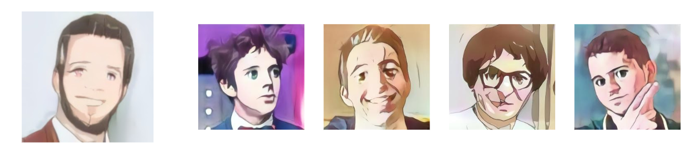
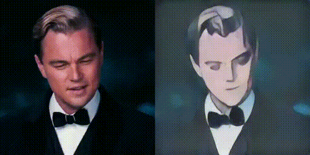

# Projet Anymus

Par ESCRIBE Florent, LANNELONGUE Vincent, LESEC Élie, SÉAILLES Romain

## Présentation et discussion sur le sujet retenu
### Synthèse du sujet proposé
L'intitulé du sujet portait sur le transfert de style.
Notre encadrant nous a proposé un sujet assez large : le but était d'imaginer un transfert d’image
ou de dessin (crayonné, bande dessinée...) vers un rendu manga. Dès le début, le sujet
était orienté machine learning et réseaux de neurones, ce qui a par la suite conditionné notre
approche.

### Notre interprétation du sujet, notre objectif

La première idée était de transformer un crayonné en un dessin de style manga. On s’est très vite
concentré sur le visage pour faciliter un peu l'approche, entre autre pour avoir une base de donnée
assez cohérente (photos/dessins cadrées de la même façon), et pour ne pas vouloir trop en faire.
Notre volonté de s’attaquer spécifiquement au visage vient aussi du fait que la forme du visage est
ce qui fait la grande particularité du style Manga par des caractéristiques fortes (gros yeux, tête
plus large, nez inexistant, etc …). Ce choix nous semble pertinent car en pratique il pourrait servir
d’assistant aux mangakas pour imaginer des visages, ou bien par exemple cela pourrait
déboucher sur une application “fun” pour des utilisateurs lambdas.
Par la suite, nous nous sommes concentrés sur la transformation d’un visage humain depuis une
photo classique en un dessin '' manga-isé '', le dessin crayonné étant problématique pour plusieurs
raisons détaillées plus tard.

### Choix techniques et algorithmiques

Dans un premier temps, nous avons travaillé sur du transfert de style : en utilisant un CNN préentraînés à la classification d'images (VGG 16 par exemple), il est possible de caractériser le style
et le contenu d'une image, et ainsi de faire varier le premier tout en conservant une partie du
2ème. Mais ces algorithmes sont adaptés à des transferts de texture (ils marchent très bien pour
appliquer le style d’un artiste à une photo), et ne sont donc pas adapté à notre problème.
Nous avons donc abandonné ce genre de technique pour se focaliser sur des GAN (Generative
Adversarial Networks, ou réseau de neurone antagoniste génératif). Un GAN repose sur 2 CNN :
un générateur qui crée une image devant faire partie de la base de données visée, et un
discriminateur qui doit être capable de déterminer si une image fait partie cette base de données
ou non. Le générateur s'entraîne en essayant de berner le discriminateur, qui lui s'entraîne dans
l'objectif inverse. Ces algorithmes sont bien plus capables de transformer une image, que notre
1ère approche.
Plus précisément, nous nous sommes attardés sur des CGAN, ou GAN cycliques. L’idée est de
combiner 2 GAN pour pouvoir créer un convertisseur entre 2 bases de données, dans les 2 sens.
Cela permet d’avoir une plus grande cohérence entre l’image de départ et le résultat. Ces
algorithmes sont plus adaptés à du changement de forme que les algorithmes de transfert de style
mentionnés précédemment. Mais il faut malgré tout largement complexifier leur structure pour en
avoir un à la hauteur du problème auquel nous nous attaquons. On utilise pour cela de la dilated
convolution afin de prendre en compte le contenu de l'image à une échelle plus grande qu'avec
des filtres de convolution plus classiques.
Dans le but de créer des bases de données adaptées, nous avons aussi réalisé plusieurs scripts
python d’extraction de databases pertinentes depuis des sites spécifiques.

### Problèmes rencontrés et remarques

Il a été difficile de mesurer l’ampleur de la tâche au début du projet. Nous nous sommes très vite
rendu compte de la complexité du travail sur le dessin : transformer l’intégralité des éléments d’une
planche de bande-dessinée (visage, corps, accessoires, vêtements, arrière-plan) en manga est
une tâche extrêmement ardue et ne peut pas être effectuée par un seul réseau. Nous avons donc
décidé de commencer d’organiser notre travail de sorte qu’à n’utiliser qu’un seul réseau de
neurones et ne traiter qu’une seule partie du personnage : le visage (pour d'autres raisons
évoquées plus tôt).
Nous avons aussi abandonné le dessin crayonné assez vite car les algorithmes déjà existants et
entraînés avaient beaucoup de mal avec, et qu’il fallait adopter une autre approche pour gérer le
dessin. Cela vient notamment du fait que, contrairement à une photo, un dessin crayonné est très
vide (beaucoup de blanc).
Pour ce qui est de notre travail sur les GAN et CGAN, nous faisons encore face à de nombreux
problèmes bien connus de convergence sur les algorithmes utilisés. Dans le cas du CGAN :
effondrement des modes, entrainement trop rapide des discriminateurs...

## Utilisation
### Structure du projet
La dernière version du projet utilise l'architecture *U-GAT-IT* légèrement modifiée et implémentée à l'aide de la bibliothèque Keras.
```
.
├── _CGAN/
│   ├── custom_layer.py
│   ├── data_loader.py
│   ├── reseaux.py
│   ├── run.py
│   ├── train.py
│   ├── utils.py
│   └──_Trombi_results/
│      ├── result-19escribe.jpg
│      └── ...
.
```
L'algorithme de transformation des visages se trouve dans le dossier CGAN.
Il est divisé comme suit :
- `custom_layer.py` contient nos propres layers fabriqués à l'aide de la bibliothèque Keras. Ce fichier contient notamment le layer à double sortie Aux permettant de créer la sortie auxiliaire caractéristique de l'architecture permettant de l'entrainer ainsi que la nouvelle fonction d'activation AdaLin à la fois contrôlée par des poids entrainables et par une entrée spécifique.
- `data_loader.py` Fichier repris et légèrement modifié du git de , permettant de gérer de façon particulièrement efficace l'importation d'images pour l'entrainement et la création de batch.
- `reseaux.py` Fichier contenant nos architectures réseau pour nos discriminateurs et nos générateurs ainsi que le modèle combiné permettant d'entrainer les seconds au travers des premiers selon les 4 équations spécifiques des Cycle GAN : Tromper le discriminateur, 2*Cycle consistency et 1 fois Identity
- `run.py` Fichier permettant d'utiliser le réseau, expliqué plus bas
- `train.py` Fichier permettant d'entrainer le réseau, expliqué plus bas
- `utils.py` contient quelques fonctions utiles notamment pour l'importation et la sauvegarde des poids des réseaux.
- `Trombi_results/` Dossier contenant nos résultats en faisant tourner notre algorithme sur les photos de profils des élèves p18 et p19 du portail des élèves.

### Utilisation du réseau : `run.py`
Le paramètre help du script explique son fonctionnement :
```
>>> python .\run.py -h
usage: run.py [-h] [-o O] [-g G] [-p P] [-m] [-v] image

Permet de faire tourner le réseau de transformation Visage -> Manga sur des images.

positional arguments:
  image          Chemin vers l'image à traiter. Cela peut aussi etre un chemin vers un dossier, auquel cas toutes les
                 images trouvées dedans seront traitées

optional arguments:
  -h, --help     show this help message and exit
  -o O           Dossier dans lequel seront stockés les résultats. Par défaut 'results/'
  -g G           Chemin vers le fichier contenant les poids du générateur à utiliser. Par défaut 'g.h5'
  -p P           Ajoute le prefixe prefixe-nom_de_l'image_original.jpg au résultat. 'result' par défaut.
  -m, --mosaic   Pour traiter des images hd qui ne doivent pas être redimensionnées en 256x256. Elles seront alors
                 composées d'une mosaic de carrés de tailles 256x256.
  -v, --verbose  Affiche les logs de tensorflow
>>>
```
Comme expliqué, il est possible de donner en entrée du script à la fois une image précise à transformée, ou bien de lui donner un dossier auquel cas le script recherchera toutes les images à l'intérieur et les traitera toutes.


Par défaut, toutes les images seront recadrées en 256x256 avant d'être modifiées. Il est malgré tout possible de traiter des images plus grandes à l'aide de l'argument mosaic, qui va alors subdiviser une grande image en une série de carrés de 256x256 pour les traiter indépendamment et reconstruire par collage l'image originale à l'arrivée. Il est à noter que cette fonction fait sortir l'algorithme de son cadre d'utilisation normal et donc ne donne pas des résultats convaincants : c'est purement une fonction de test qui a été laissée dans la version finale.


Un générateur préentrainé peut être trouvé ici en libre accès :
`https://drive.google.com/file/d/1JhXtRSGdsbo9iFZIaCmXsc0j1l7TIWFf/view?usp=sharing`


Exemple d'utilisation :
```
>>> python .\run.py -g .\g.h5 -o .\results_live\ .\inputs_live\
Using TensorFlow backend.
Traitement du dossier .\inputs_live\ en 256x256
Weights loaded
100%|███████████████████████████████████| 9/9 [00:11<00:00,  1.25s/it]
>>>
```
Ce qui donne comme résultat les images proposées en introduction du *README*.

Il est aussi possible de l'utiliser sur une séquence d'image puis de recompiler le tout pour en faire un .gif amusant :
```
>>> python .\run.py -o .\Gatsby_output\ -g .\g.h5 .\Gatsby\
Using TensorFlow backend.
Traitement du dossier .\Gatsby\ en 256x256
Weights loaded
100%|███████████████████████████████████| 89/89 [00:13<00:00,  6.47it/s]
>>>
```
Ce qui donne comme résultat après avoir recompilé les images avec *ffmpeg* en un gif:



### Entrainement du reseau : `train.py`
`train.py` est beaucoup moins user friendly que `run.py`.
Il suffit simplement de le lancer pour lancer l'entrainement. Le seul paramètre possible est un nombre qui permet de reprendre à n'importe quel epoch, utile lorsque l'entrainement est interrompu puis repris pour assurer la continuité des photos générées.


Il est possible de spécifier à l'intérieur du code certaines variables, notamment :
- `EPOCHS = 200` donne le nombre d'epochs à faire pendant l'entrainement
- `dataset_name` Définie le nom du dataset à utiliser, ce qui doit match le nom du dossier contenu dans `CGAN/datasets/`
- `SAMPLE_INTERVAL` Période (en termes de nombre d'images sur lesquels le réseau s'entraine) d'enregistrement de résultats sur le dataset test dans `CGAN/images/`


Le lancement de ce script va créer et utiliser certains dossiers:
```
.
├── _CGAN/
│   ├── _datasets/
│   │   └── _dataset_name/
│   │       ├── trainA/
│   │       ├── trainB/
│   │       ├── testA/
│   │       └── testB/
│   ├── _images/
│   │   └── dataset_name/
│   ├──_Weights/
│   │   └── _dataset_name/
│   │       ├── d_A.h5
│   │       ├── d_B.h5
│   │       ├── g_AB.h5
│   │       ├── g_BA.h5
│   │       ├── aux_d_A.h5
│   │       ├── aux_d_B.h5
│   │       ├── aux_g_AB.h5
│   │       └── aux_g_BA.h5
│   .
.
```
Le seul dossier *indispensable* est `CGAN/datasets/dataset_name/`. Il est en effet nécessaire d'avoir une database pour pouvoir entrainer le réseau. 
Notre database est disponible ici : 
`URL`


Le dossier `images/` contient des images générées toutes les `SAMPLE_INTERVAL` images traitées sur le dataset test pour constater l'avancée de l'entrainement.


Le dossier `Weights/`contiens les poids des différentes structures utilisées pendant l'entrainement. Le seul utilisé dans la suite par `run.py`est `g_AB.h5` (bien que techniquement il soit possible de lui substituer `g_BA.h5` si l'objectif est de transformer des visages manga en visages photoréalistes).
